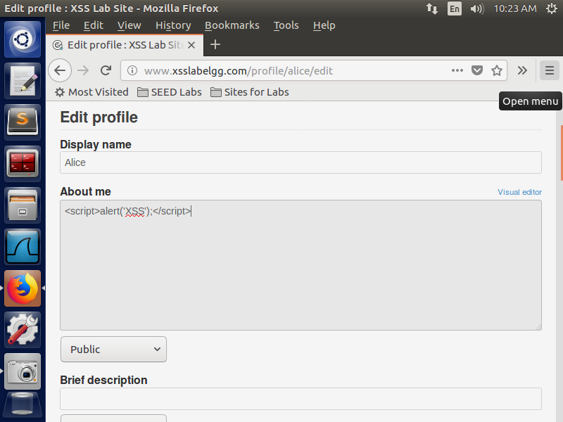
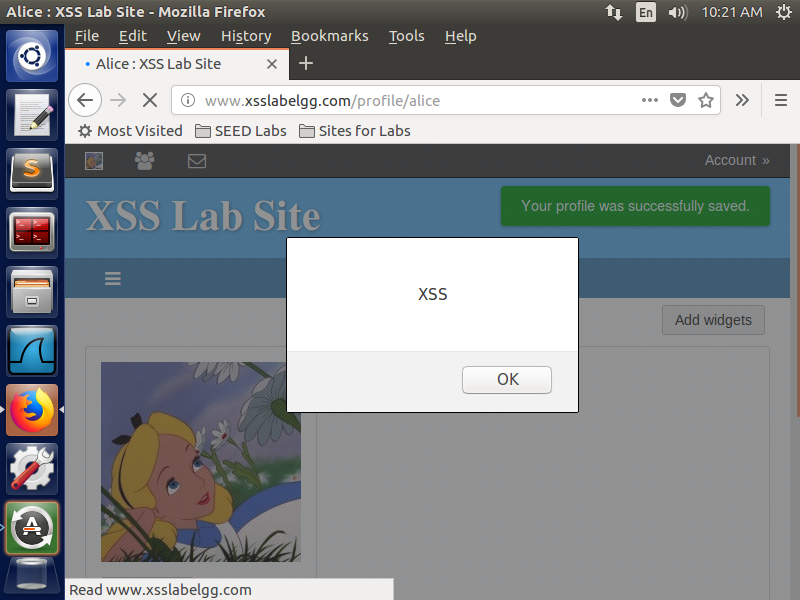

## Task 1: Posting a Malicious Message to Display an Alert Window

**Objective:** Embed a JavaScript snippet in the user profile to trigger an alert window for any viewer.

**Steps:**
1. Logged into the Elgg application using a predefined user account.
2. Navigated to the profile edit page and injected the following script in the "About Me" section: 
    ```html
    <script>alert('XSS');</script>
    ```
3. Viewed the profile from another user account to observe the behaviour.


*Script Injection*


*Profile View with Alert*

**Observation:** We see an alert box displaying "XSS" after visiting the profile, meaning the JavaScript code has been successfully executed.
