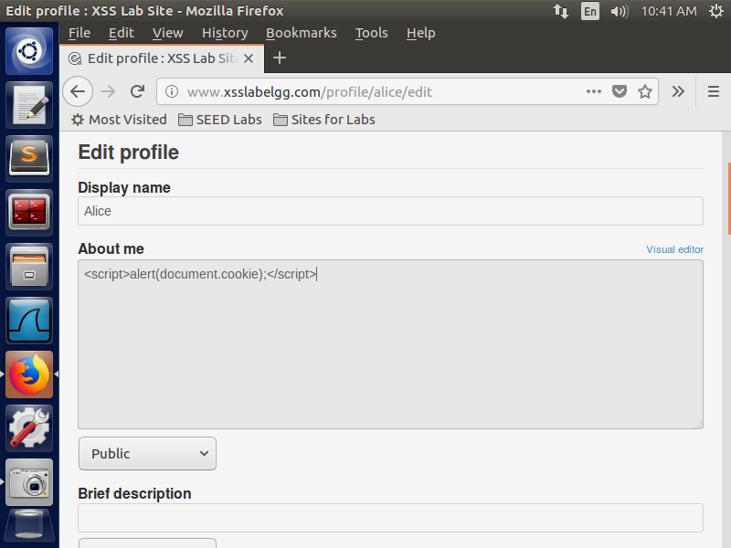
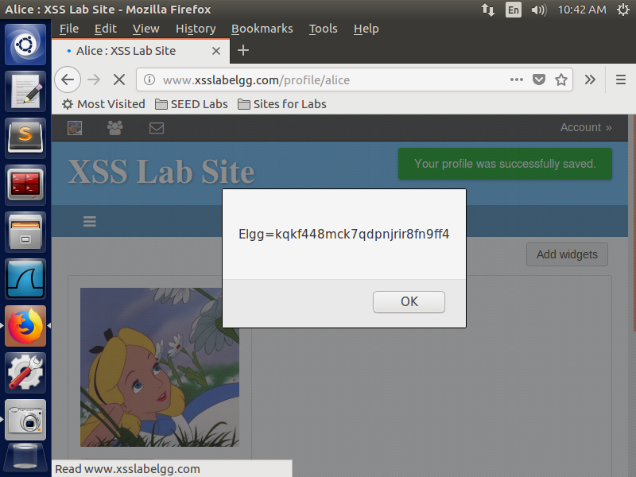

## Task 2: Posting a Malicious Message to Display Cookies

**Objective:** Modify the JavaScript to display the viewer's cookies in an alert window.

**Steps:**
- Updated the script in the profile to:
```html
<script>alert(document.cookie);</script>
```
- Viewed the profile from a different user account.


*Script Injection*


*The Alert showing cookies*

**Observation:** The viewer's cookies were displayed in the alert window, demonstrating how an attacker could access session cookies.