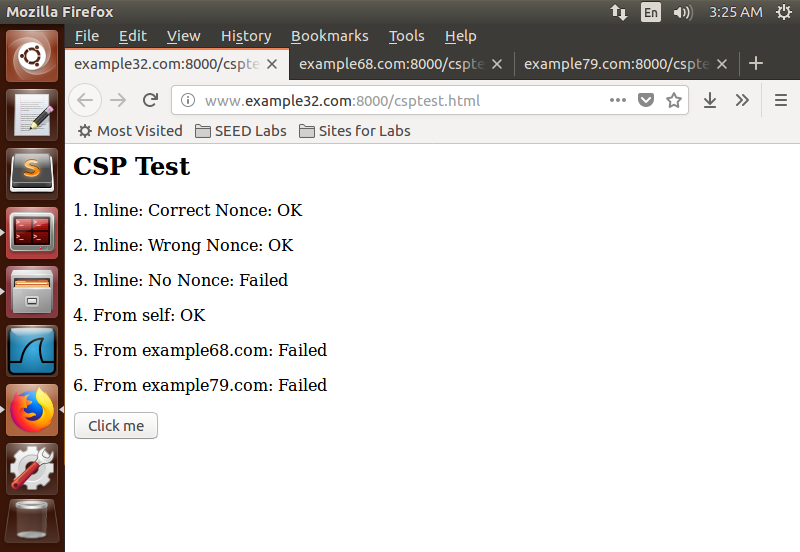

## Task 7: Defeating XSS Attacks Using CSP

**Objective:** Understand and implement Content Security Policy (CSP) to prevent XSS attacks.

**Steps:**
- Set up a web server using the provided Python code (http\_server.py) to serve the csptest.html page with a CSP header.
```python
#!/usr/bin/env python3

from http.server import HTTPServer, BaseHTTPRequestHandler
from urllib.parse import *

class MyHTTPRequestHandler(BaseHTTPRequestHandler):
    def do_GET(self):
        o = urlparse(self.path)
        f = open("." + o.path, 'rb')
        self.send_response(200)
        self.send_header('Content-Security-Policy',
                    "default-src 'self';"
                    "script-src 'self' *.example68.com:8000 'nonce-1rA2345' 'self' *.example79.com:8000 'nonce-2rB3333' 'nonce-3rC4455' ")
        self.send_header('Content-type', 'text/html')
        self.end_headers()
        self.wfile.write(f.read())
        f.close()

httpd = HTTPServer(('127.0.0.1', 8000), MyHTTPRequestHandler)
httpd.serve_forever()
```

- Added DNS entries to the /etc/hosts file for the domains www.example32.com, www.example68.com, and www.example79.com, mapping them to 127.0.0.1.
- Accessed the csptest.html page via the following URLs and observe the behaviour:
    - http://www.example32.com:8000/csptest.html
    - http://www.example68.com:8000/csptest.html
    - http://www.example79.com:8000/csptest.html
- Modified the server program (http\_server.py) to change the CSP header and allowed sources for scripts.


*Editing the Python code*


*Initial csptest page of example32.com*


*Initial csptest page of example68.com*


*Initial csptest page of example79.com*

**Observation:** After starting the Apache server and pointing the domains in hosts file, initially we find area 3, 5, & 6 showing Failed which means the Python file needs to be edited. 

By modifying the CSP header, the server explicitly whitelists trusted script sources and nonces, preventing execution of untrusted scripts and mitigating XSS attacks.

Then we see,

- http://www.example32.com:8000/csptest.html
    - area1: OK (Correct nonce value '1rA2345')
    - area2: OK ('unsafe-inline' allows inline scripts without nonce)
    - area4: OK (Script loaded from 'self' source)
    - area5: OK (Script loaded from *.example68.com:8000 source)
- http://www.example68.com:8000/csptest.html
    - Same observations as above URL.
- http://www.example79.com:8000/csptest.html
    - area3: Failed (Inline script without nonce, 'unsafe-inline' not allowed)


*Final csptest page of example32.com*


*Final csptest page of example68.com*


*Final csptest page of example79.com*

Thus, Fields 1, 2, 4, 5, and 6 all display OK after changing the Python code.